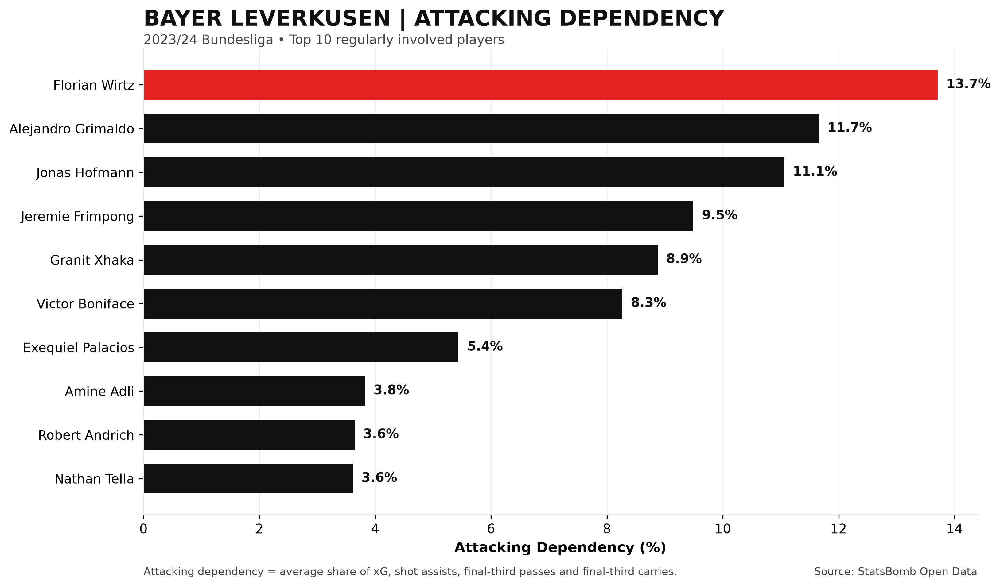
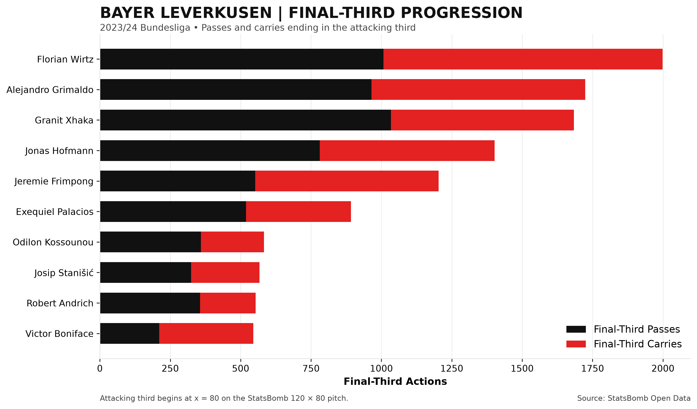
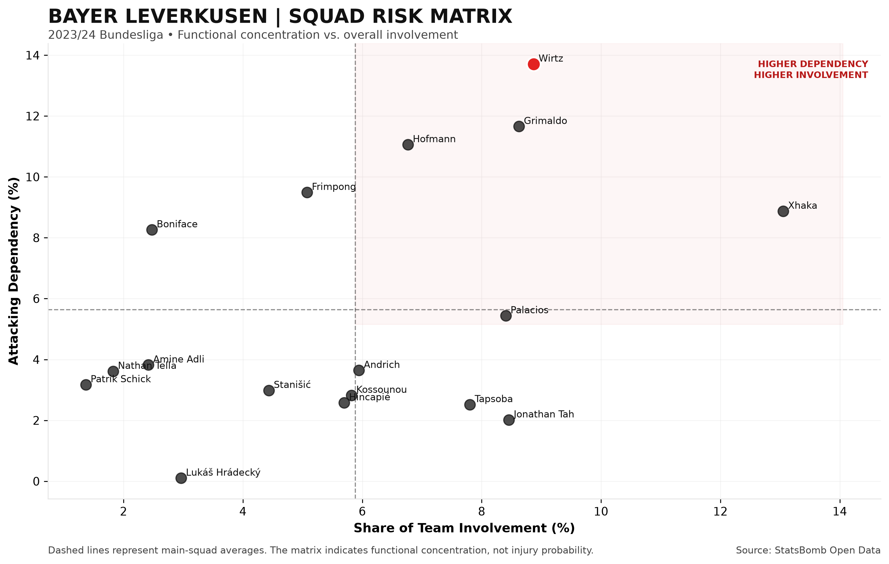
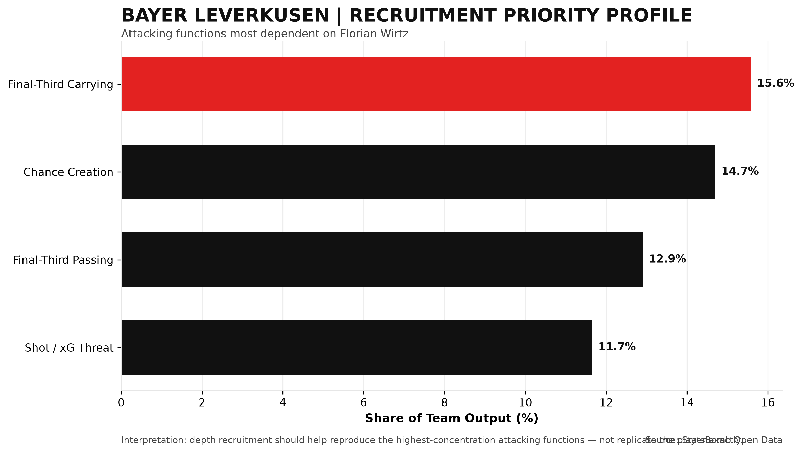

# Bayer Leverkusen Squad Risk & Recruitment Analysis

### Identifying player dependency and squad-depth priorities using event-level football data

**Python | Pandas | StatsBomb Open Data | Matplotlib | Excel**

---

## Project Overview

Following Bayer Leverkusen's 2023/24 Bundesliga season, maintaining squad performance requires understanding where important team functions are concentrated among individual players.

This project uses event-level match data to answer a recruitment-focused question:

> **Which players and attacking functions does Bayer Leverkusen depend on most, and what player profile should recruitment prioritize to reduce that dependency?**

Using Python and StatsBomb Open Data, I analyzed Bayer Leverkusen's Bundesliga event data, constructed player-level performance metrics, measured each player's share of key team functions, and translated the highest area of attacking dependency into a recruitment profile.

The project includes a complete Python analysis pipeline, four data visualizations, processed datasets, and a business-facing Excel report.

---

## Business Questions

The analysis focuses on three primary questions:

1. **Which players and roles are most important to Leverkusen's attacking output?**
2. **What specific abilities would be most difficult to replace if a key player became unavailable?**
3. **What player attributes should recruitment prioritize when adding attacking depth?**

---

## Data

**Source:** StatsBomb Open Data  
**Competition:** Bundesliga  
**Season:** 2023/24  
**Team:** Bayer Leverkusen

The analysis covers:

- **34 Bundesliga matches**
- **137,765 total match events**
- **81,440 Bayer Leverkusen events**

Event types include passes, carries, shots, pressures, ball recoveries, duels, dribbles, clearances, and other on-ball and defensive actions.

The raw event data is retrieved programmatically using `statsbombpy`.

---

## Methodology

### 1. Player-Level Metrics

Event data was aggregated to create player-level measures including:

- Passes
- Carries
- Shots
- Expected Goals (xG)
- Pressures
- Ball recoveries
- Shot assists
- Final-third passes
- Final-third carries
- Total measured actions

For this analysis, the final third begins at **x = 80** on StatsBomb's 120 × 80 pitch.

### 2. Dependency Shares

For each metric, I calculated the percentage of Bayer Leverkusen's total team output contributed by each player.

Three summary indicators were then created.

**Attacking Dependency**

Average of a player's team share of:

- xG
- Shot assists
- Final-third passes
- Final-third carries

**Possession Dependency**

Average of a player's team share of:

- Passes
- Carries

**Defensive Dependency**

Average of a player's team share of:

- Pressures
- Ball recoveries

To focus the analysis on regularly involved players, the primary dependency analysis includes players with at least **500 measured actions**.

These dependency measures are custom analytical indicators designed for this project and are not official StatsBomb metrics.

---

# Key Findings

## 1. Attacking Dependency



**Florian Wirtz had the highest attacking dependency score at 13.7%.**

The next highest players were:

- Alejandro Grimaldo — **11.7%**
- Jonas Hofmann — **11.1%**
- Jeremie Frimpong — **9.5%**
- Granit Xhaka — **8.9%**

The results show that Leverkusen's attacking production was distributed across several important players, while Wirtz contributed the largest combined share across the attacking functions measured in this project.

---

## 2. Final-Third Progression



Final-third passes and carries were analyzed separately to understand **how players progressed possession into advanced areas**.

Wirtz recorded the highest combined final-third progression among the analyzed players, with Grimaldo and Xhaka also providing substantial progression.

The split between passing and carrying is particularly useful for recruitment because two players may produce similar total progression while accomplishing it through different playing styles.

---

## 3. Squad Dependency Matrix



The squad dependency matrix compares:

- **Overall team involvement** on the x-axis
- **Attacking dependency** on the y-axis

Players toward the upper-right of the visualization combine high overall involvement with high attacking dependency.

Wirtz and Grimaldo stand out in this area, while Xhaka displays especially high overall involvement with a different attacking dependency profile.

This provides a way to distinguish between players who are heavily involved in the overall system and players whose contributions are particularly concentrated in attacking functions.

---

## 4. Recruitment Priority Profile



Because Wirtz recorded the highest attacking dependency score, I broke his attacking contribution into its underlying components.

| Recruitment Attribute | Share of Team Output |
|---|---:|
| Final-Third Carrying | **15.6%** |
| Chance Creation | **14.7%** |
| Final-Third Passing | **12.9%** |
| Shot / xG Threat | **11.7%** |

This produces a measurable recruitment profile rather than simply identifying a player who needs a "backup."

---

# Recruitment Interpretation

The analysis suggests that attacking depth recruitment should prioritize players capable of:

- Progressing possession through **final-third carries**
- Consistently **creating shooting opportunities for teammates**
- Delivering **progressive passes into advanced areas**
- Maintaining a credible **shooting and xG threat**

The objective would not necessarily be to find a player identical to Florian Wirtz.

Instead, recruitment could target players who reproduce several of the attacking functions that are currently concentrated in Leverkusen's highest-dependency players. This could help reduce the team's reliance on any single player for progression and chance creation.

---

# Excel Analytics Report

In addition to the Python analysis, the project generates a formatted Excel workbook:

**`Bayer_Leverkusen_Squad_Risk_Analysis.xlsx`**

The workbook contains six sections:

1. **Executive Summary**
2. **Player Metrics**
3. **Squad Dependency**
4. **Recruitment Profile**
5. **Visual Analysis**
6. **Methodology**

The Excel report is designed as the business-facing deliverable for a recruitment or analytics department, while the Python scripts provide the reproducible analytical pipeline.

---

# Project Structure

```text
Leverkusen_Analysis/
│
├── README.md
├── analysis.py
├── create_excel.py
├── Bayer_Leverkusen_Squad_Risk_Analysis.xlsx
│
├── data/
│   ├── player_metrics.csv
│   └── squad_dependency.csv
│
└── images/
    ├── attacking_dependency.png
    ├── final_third_progression.png
    ├── squad_risk_matrix.png
    └── recruitment_priority_profile.png
```

The full raw event dataset is not stored in the repository. It can be retrieved through the analysis script using StatsBomb Open Data.

---

# Technologies Used

- **Python**
- **Pandas**
- **NumPy**
- **StatsBombPy**
- **Matplotlib**
- **OpenPyXL**
- **Microsoft Excel**
- **VS Code**
- **Git / GitHub**

---

# Running the Project

### 1. Install the required Python packages

```bash
pip install statsbombpy pandas numpy matplotlib openpyxl
```

### 2. Run the analysis

```bash
python3 analysis.py
```

The script downloads the required StatsBomb event data if it is not already available locally and generates the processed datasets and visualizations.

### 3. Generate the Excel report

```bash
python3 create_excel.py
```

This creates:

```text
Bayer_Leverkusen_Squad_Risk_Analysis.xlsx
```

---

# Limitations

This project measures **functional concentration**, not complete player value or true replacement ability.

Several limitations should be considered:

- The analysis does not adjust metrics for player minutes.
- The main-squad threshold of 500 measured actions is a practical analytical filter rather than an official threshold.
- The dependency indicators use equal weighting across their component metrics.
- Player positions and tactical roles are not explicitly modeled.
- Event counts do not capture every off-ball contribution.
- The analysis identifies desirable recruitment attributes rather than ranking specific transfer targets.

Future versions could incorporate minutes played, position-specific benchmarks, possession-adjusted metrics, similarity modeling, and candidate scouting data.

---

# Project Goal

The goal of this project was to demonstrate how event-level football data can be transformed into a **decision-oriented recruitment analysis**.

Rather than stopping at player performance statistics, the project connects:

**Raw Event Data → Player Metrics → Dependency Analysis → Squad Risk → Recruitment Profile → Business-Facing Report**

This workflow demonstrates how Python-based sports analytics can support practical recruitment and squad-planning decisions.

---

## Author

**Joshua Barnum**  
Data Science | University of Pittsburgh  
Sports Analytics & Data Science